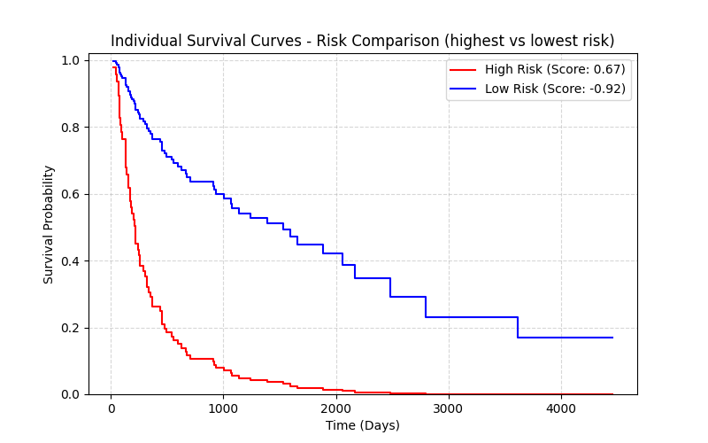
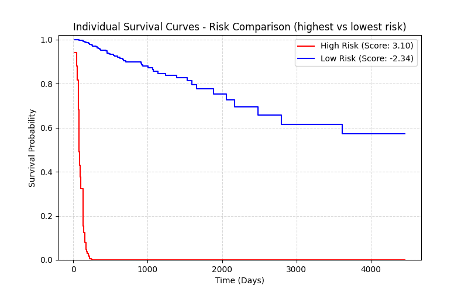
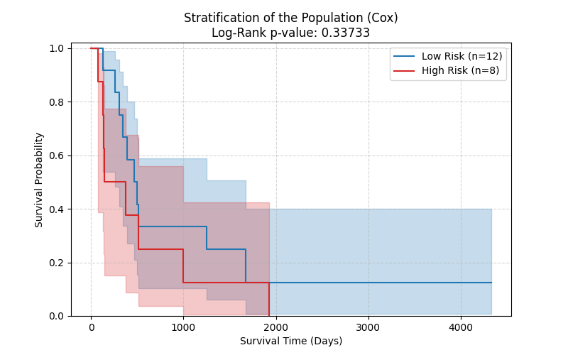
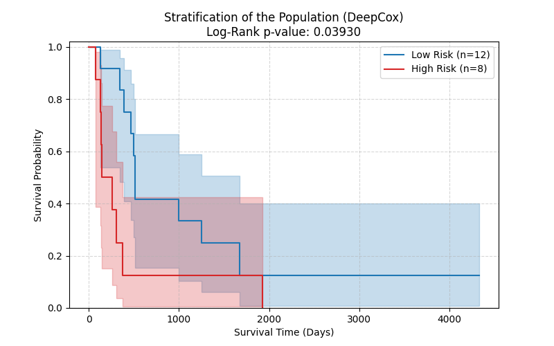
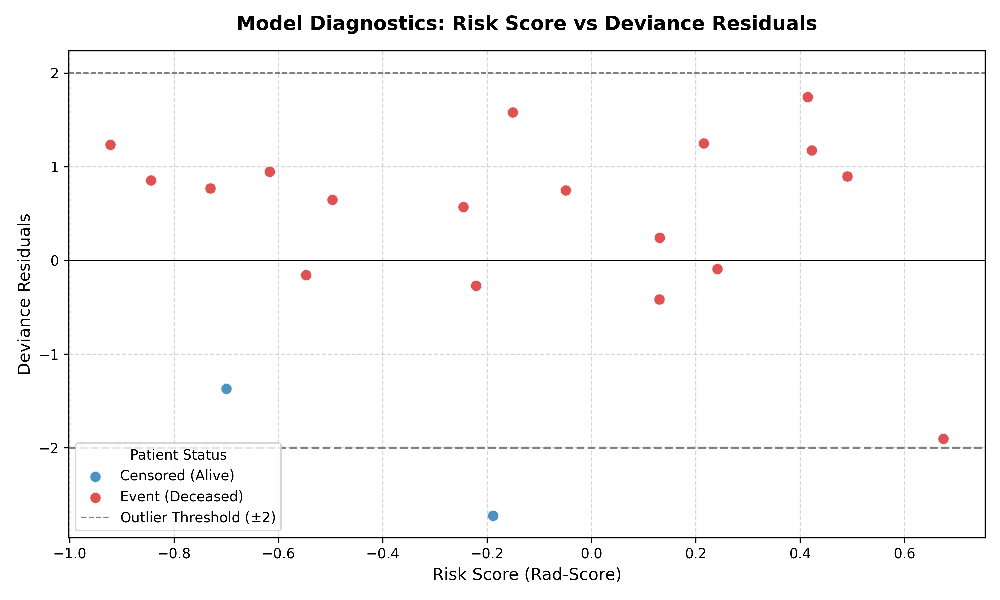
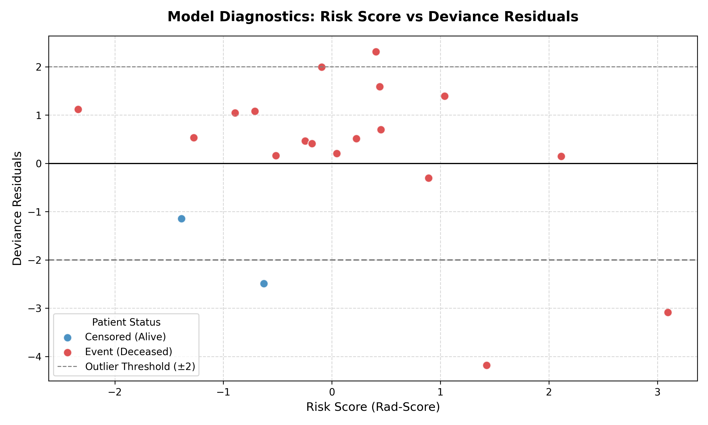

# nsclc_survival
### NSCLC Radiomics: Survival Time prediction using CT-extracted features and clinical data.

This is a Python package designed for analyzing CT-extracted radiomic features and clinical data, specifically built for survival analysis and prognosis modelling.

* [Project Overview](#project-overview)
* **Theory**:
   * [Survival Data](#survival-data)
   * [Proportional Hazards Models](#proportional-hazards-models)
   * [Model Evaluation](#model-evaluation)
* [Installation](#installation)
* [Usage](#usage)
* [Testing](#testing)
* [Table of Contents](#table-of-contents)
* [Configuration and Customization](#configuration-and-customization)
* [Pipeline Workflow](#pipeline-workflow)
* [To Show Some Results](#to-show-some-results)
* [References](#references)
* [Licence](#license)
* [Contacts](#contacts)

## Project Overview
Survival Analysis plays a pivotal role in the medical field, especially in oncology, where predicting disease progression and survival outcomes becomes essential for cancer prognosis and treatment planning. 

The core objective of this study is to predict patient survival outcomes and stratify individual risk using the public **NSCLC-Radiomics dataset**, also investigating which radiomic and clinical features most significantly affect patient survival. 

By extracting radiomic and clinical features, the pipeline handles data censorship and implements two primary methodological approaches:
1. **Standard Lasso-Cox Proportional Hazards Model:** Used as a semi-parametric linear baseline.
2. **Deep Cox Proportional Hazards Network (DeepSurv):** A deep learning-based framework designed to capture complex, non-linear feature interactions.

These approaches are statistical methods designed to analyze the time until a specific event occurs (e.g., the patient death). They are built to handle censored data, so situations where the event has not occurred before the end of the study, or the subject is lost to follow-up.

A classification of the patients through a risk stratification is also performed to divide the dataset into High and Low Risk classes, containing patients with an expected survival below and above the median risk score respectively.

For the evaluation of the aforementioned classification the following Non-Parametric Methods are adopted:
1. **Kaplan-Meier Method**, which estimates the unadjusted probability of surviving beyond a certain time point; particularly, a Kaplan-Meier curve shows the estimated survival function by plotting estimated survival probabilities against time. 
2. **Log-Rank Test**, which tests the null hypothesis that there is no difference in the probability of an event at any time point across the different curves, evaluating through the computation of the p-value whether the distance between the survival curves of two or more different groups is statistically significant or simply due to chance.

## Survival Data
Survival data is comprised of three elements: baseline data $x$, an event time $T$, and an event indicator $E$. The time $T$ corresponds to the time elapsed between the time in which the baseline data was collected and the time of the event occurring (when $E=1$), or the time of the last contact with the patient (when $E=0$). 

Two fundamental elements for the survival analysis are:
1. **Survival Function**: it describes the probability that an individual
survives past a specified time point $t$ and is denoted by: 

$$
S(t)=\Pr(T>t)
$$

2. **Hazard Function**: it describes  the instantaneous hazard rate over time, which represents the rate of occurence of the event during an infinitesimally small time interval. Its value is not a probability, but an indicator of the risk of experiencing the event. It  is linked to the probability of an individual dying at time $t$ given that he or she has survived up to that point, and can be defined as follows: 

$$
\lambda(t) = \lim_{\delta \to 0} \frac{1}{\delta} \Pr(t \le T < t + \delta \mid T \ge t)
$$ 

## Proportional Hazards Models
Proportional hazards models are common methods for modeling an individual’s survival given their baseline data $x$. 

For these models the corresponding hazard function takes the form: 

$$
\lambda(t|x) = \lambda_0(t)\cdot e ^{h(x)}
$$

where $\lambda_0(t)$ is the baseline hazard function, and $h(x)$ is the risk function. 

In **Cox Proportional Hazards model** this hazard function becomes: 

$$
\lambda(t|x)=\lambda_0(t)\cdot e^{\beta_1 x_1+...+\beta_p x_p}
$$

where $\lambda(t|x)$ is the hazard at time $t$, $x_1,...,x_p$ are the predictors, $\lambda_0(t)$ is the baseline hazard function common to all patients, and $\beta_1,...,\beta_p$ are the model parameters describing the effect of the predictors on the overall hazard.  Under this formulation, each subject's individual hazard function is obtained by multiplying the common baseline hazard by the subject-specific factor $e^{h(x)}$, where $h(x)=\beta_1 x_1+...+\beta_p x_p$ represents the linear risk function (or log-hazard). The quantity $e^{h(x)}$ is therefore a relative risk multiplier.

The ratio of the hazard rates between different patients is defined as the hazard ratio (HR). An HR greater than 1 indicates that the event is more likely to occur (increased risk), while an HR less than 1 indicates the event is less likely to occur (decreased risk). An HR of exactly 1 signifies that the predictor has no effect on the hazard of the event. 

To perform Cox regression, the parameters $\beta$ are tuned to optimize the Cox partial likelihood, which computes the probability at each event time $T_i$ that the event occurred to individual $i$, given the set of individuals who are still at risk at that same time $T_i$. It can be defined as: 

$$
L_c(\beta)=\prod_{i:E_i=1}\frac{\exp(h_\beta(x_i))}{\sum_{j\in \mathcal{R}(T_i)} \exp(h_\beta(x_j))}
$$

where the values $T_i$, $E_i$, and $x_i$ are the respective event time, event indicator, and baseline data for the $i^{th}$ observation. The risk set $\mathcal{R}(t)=\\{i:T_i \ge t\\}$ represents the set of patients still at risk of death at time $t$. There the notation $h_\beta(x)$ has been used instead of $h(x)$ to make clear the dependence on the parameters $\beta$.

To prevent overfitting and perform feature selection on the high-dimensional radiomic data, a **Lasso (L1) regularization** penalty is introduced to the log-partial likelihood. The objective function to maximize becomes:

$$
\ell_{\text{Lasso}}(\beta) = \log L_c(\beta) - \alpha \sum_{k=1}^{p} |\beta_k|
$$

where $\alpha \ge 0$ is the regularization strength tuning parameter, and $\sum |\beta_k|$ represents the $L_1$ norm of the parameter vector. This penalty forces the coefficients of the least informative features to be exactly zero, effectively selecting the most relevant prognostic indicators.

However, classic Cox PH model may be too simplistic for fitting complex, real-world biological datasets, and for this reason the **Deep Cox Proportional Hazards Network (DeepSurv)** was implemented, extending the traditional Cox PH model by exploiting neural networks. While the classical statistical approach focuses on maximizing the log-partial likelihood, deep learning frameworks are conventionally trained by minimizing a cost function. Therefore, DeepSurv shifts the problem into a minimization task by defining its loss function as the **negative** log-partial likelihood:

$$
\ell(\theta) := - \sum_{i:E_i=1}\bigg(h_\theta(x_i)-\log \sum_{j \in \mathcal{R}(T_i)}e^{h_\theta(x_j)}\bigg)
$$

Structurally, DeepSurv is a multi-layer perceptron where a deep architecture and modern deep learning techniques - such as Weight Decay Regularization (which acts as an $L_2$ penalty, balancing the $L_1$ Lasso used in the linear baseline), Rectified Linear Units (ReLU), Batch Normalization, Dropout - ensure stable training, accelerate convergence, and prevent overfitting. The output of the network is a single node, which estimates the non-linear risk function $h_\theta(x)$ parameterized by the weights of the network $\theta$. DeepSurv's major strength is its ability to generate personalized treatment recommendations. 

## Model Evaluation
The final evaluation of both models is performed by computing the following metrics.
### Harrel's Concordance index (C-index)
Ranging from 0.0 (terrible performance) to 1.0 (perfect prediction) it measures the model's predictive performance.
### Integrated Brier Score (IBS)
It measures  the model’s global probabilistic survival prediction accuracy and it's defined by the formula:

$$
\text{IBS} = \frac{1}{t_{max}-t_{min}}\int^{t_{max}}_{t_{min}}\text{BS}{(t)}dt
$$

where 

$$
\text{BS}(t) = \frac{1}{n} \sum^n_{i=1}\big(\textbf{Y}_i- S_i(t)\big)^2.
$$

which corresponds to the squared distance between the survival probability computed by the model and the real status of the patient (1 = patient alive, 0 = patient dead) 

Specifically, its interpretation is bounded by the following benchmarks:
   * $\text{IBS}=0$; the model is perfect, capable of predicting the exact event status with absolute certainty across all time steps;
   * $\text{IBS}=0.25$; the model is random and assigns a fixed 50\% survival probability ($0.5$) to all patients, revealing itself equal to a completely uninformative random guess ($(1-0.5)^2=0.25$);
   * $\text{IBS}<0.25$; the model performs better than an uninformative random guess, so it possesses real prognostic value;
   * $\text{IBS}>0.25$; the model performs worse than an uninformative random guess, revealing severe miscalibration.


### Linear Residuals (Mean Absolute Error, MAE, and Root Mean Squared Error, RMSE)
They were computed by the survival time predictions in days and months derived from the survival functions:

$$
\text{MAE} = \frac{1}{n}\sum^n_{i=1}|y_i-\hat y_i|, \quad\quad \text{RMSE} = \sqrt{\frac{1}{n}\sum^n_{i=1}(y_i-\hat y_i)^2}
$$
   
where $\hat y_i$ is the predicted survival time and $y_i$ is the real survival time. For this specific analysis only patients who experienced the event were considered.

### Martingale and Deviance residuals
They identify outliers. 

The martingale residual ($M_i$) is:
   
$$
M_i = \delta_i - \Lambda_i(t_i)
$$

where $\delta_i$ is the binary status event (1 = Death, 0 = Censored) and $\Lambda_i(t_i)=-\ln S_i(t_i)$ is the cumulative hazard function with the subject's specific exit time from the study $t_i$. It allows for a direct comparison with the clinical outcome:
   * For patients who experienced the event ($\delta_i = 1$), a large positive residual ($M_i \approx 1$) indicates that the subject died much earlier than expected, revealing an underestimation of risk by the model.
   * For censored patients ($\delta_i = 0$), the residual is inherently negative ($M_i$ = - $\Lambda_i$($t_i$)), quantifying the cumulative risk exposure up to time $t_i$ during which the patient remained successfully event-free. A large negative value highlights individuals who remained alive despite the model assigning them a severe risk profile.

Martingale residuals captures discrepancies between observed and expected events, bur they are highly asymmetric - their domain is $(-\infty,+1)$ - and this skewness prevents the definition of standard, symmetric thresholds for outlier identification in the residual plots. 
   
To overcome this, Deviance residuals ($D_i$) are then calculated as follows:

$$
D_i = \text{sign}(M_i) \sqrt{-2 \left[ M_i + \delta_i \log(\delta_i - M_i) \right]}
$$

where $\text{sign}(M_i)$ extracts the algebraic sign of the underlying Martingale residual. This non-linear transformation forces the residual distribution to be approximately symmetric and centered around zero. Deviance residuals provide an intuitive clinical interpretation for diagnostic screening:
   * Values close to $0$ identify individuals whose survival trajectory aligns perfectly with the model's expectations.
   * Large positive values ($D_i > 2$) expose high-residual outliers, representing patients who experienced an early death despite possessing a low-risk profile.
   * Large negative values ($D_i < -2$) isolate subjects who remained event-free for an exceptionally long duration despite being flagged with a severe, high-risk prognostic signature.

## Installation

Python version supported : 

### Prerequisites

Before installing the package, please ensure your system satisfies the following requirements:

1. **C++ Compiler**: Due to the underlying C/C++ extensions in `pyradiomics` and `scikit-survival`, a C++ compiler must be present on the system.
2. **Python Version**: This project requires **Python 3.8, 3.9 or 3.10** (3.9+ recommended due to dependencies such as `scikit-survival` and `pyradiomics`). Also for this reason it is recommended to use a virtual environment.

The complete list of requirements for the `nsclc_survival` package is reported in the [requirements.txt](https://github.com/irene-ballantini/nsclc_survival/blob/main/requirements.txt).

| :warning: CRITICAL NOTE ON PYRADIOMICS & NUMPY COMPATIBILITY |
|:------------------|
| Due to legacy build constraints in the `pyradiomics` library, running a standard single-step installation (e.g., `pip install -r requirements.txt`, or `pip install -e .`) **will fail** with a `ModuleNotFoundError: No module named 'numpy'`, even if the `numpy` library is present in the requirements file and in setup.py and pyproject.toml. `pyradiomics` requires `numpy` to be physically present in the active environment *before* its own metadata generation and compilation processes begin; it cannot resolve `numpy` as a parallel dependency during a bundled installation. |

---
### Setup Instruction (Important)
To ensure a smooth setup and install `nsclc_survival` package in `Python`, install the dependencies sequentially by following these steps:

1. Clone the repository
   ```
   git clone https://github.com/irene-ballantini/nsclc_survival
   cd nsclc_survival
   ```
2. Create and activate your virtual environment (venv/conda) with one of the supported Python versions inside the `nsclc_survival` folder. 
If you use venv, you can safely create the environment folder inside the project root; the .gitignore file is already pre-configured to ignore common names such as venv/, .venv/, env/, or nsclc_env/.

3. Install the dependencies
   ```
   pip install numpy
   pip install -r requirements.txt
   pip install --editable . 
   ```
> [!NOTE]
> **WINDOWS USERS: WinError 206 (Filename too long)**
> 
> Windows users might encounter a `WinError 206` (Filename or extension too long) when running `pip install -r requirements.txt`. This happens because deep dependency trees (like PyTorch) can exceed Windows' default 260-character path limit.
> 
> **Solution:** Simply run `pip install -r requirements.txt` a second time. The second attempt will successfully bypass the path limit by leveraging the partially cached installation from the first run.

## Usage
Once the installation is complete, you can run the NSCLC Survival Analysis pipeline directly from your terminal. 

The project includes a Command Line Interface (CLI) that allows you to customize the execution parameters without modifying the source code.

### Running the Pipeline

You can launch the program in two equivalent ways (ensure your virtual environment is active):

1. Using the package shortcut
   ```
   nsclc_survival
   ```

2. Or using the standard Python module syntax
   ```
   python -m nsclc_survival
   ```
### Command Line Interface (CLI) Options
You can append optional arguments to the command to modify the pipeline parameters. The full list of available flags for the customization of the command line can be obtained by calling:
```bash
$ nsclc_survival --help

usage: nsclc_survival [-h] [--n-patients N_PATIENTS] [--cv-folds CV_FOLDS] [--epochs EPOCHS] [--batch-size BATCH_SIZE] [--hidden-dims HIDDEN_DIMS [HIDDEN_DIMS ...]] [-v] [--skip-download] [--skip-extraction]

NSCLC Survival Analysis Pipeline: Survival Time prediction using CT-extracted features and clinical data.

options:
  -h, --help            show this help message and exit
  --n-patients N_PATIENTS
                        Number of patients to download (default from settings: 100)
  --cv-folds CV_FOLDS   Folds for the Lasso Cross-Validation in Cox model. Default to 5.
  --epochs EPOCHS       Epochs of training for Deep Cox
  --batch-size BATCH_SIZE
                        Batch size of training for Deep Cox
  --hidden-dims HIDDEN_DIMS [HIDDEN_DIMS ...]
                        Hidden dimensions for the Deep Cox neural network (e.g., --hidden-dims 128 64 32)
  -v, --version         Show the current package version and exit
  --skip-download       Skip the download and organization of DICOM data (use local data if present)
  --skip-extraction     Skip the preprocessing and extraction of radiomic features
```
To see how `--skip-download` and `--skip-extraction` influence the pipeline workflow go to the [Pipeline Behavior Matrix](#pipeline-behavior-matrix) section. Instead execution examples and Use Cases of the Command Line are listed below the [Execution Examples and Use Cases](#bulb-execution-examples-and-use-cases) section.

### Quick Example of Use (No Modelling Included)

Since the default number of patients to download is set to 100, you can quickly test the pipeline's operation on a smaller cohort by running:
```
nsclc_survival --n-patients 15
```
> [!CAUTION]
> While **15** patients are enough to test the data download, preprocessing, and radiomic feature extraction phases, this minimal cohort is generally **insufficient for the modelling phase**. Depending on the random split, the pipeline will safely interrupt the execution after feature extraction due to one of the following built-in security checks:
> 
> * **Stratification Failure (ValueError):** If the 15 selected patients do not contain enough events or non-events to perform a stratified split, `scikit-learn` will stop the execution and the following message will appear:
>   ```text
>   CRITICAL ERROR DURING DATA SPLITTING: The least populated class in y has only 1 member, which is too few...
>   Please increase the number of patients (e.g., --n-patients 40) to ensure a stable statistical split.
>   ```
> * **Insufficient Training Data Size:** Even if the split succeeds, if the resulting Train Set contains fewer than 15 patients, the pipeline will halt to prevent mathematical crashes and non-convergence during Cross-Validation or Deep Learning training.
>
> To successfully run the **entire pipeline** (including Lasso-Cox, Deep Cox, and risk classification reports), it is highly recommended to use at least **40 patients** (`--n-patients 40`); this number depends on the composition of the dataset.

**Note**: Running this smaller setup with 15 patients allows you to quickly verify that all structural components of the pipeline function correctly. Data downloading, preprocessing, and radiomic feature extraction are highly time-consuming phases; starting with a minimal cohort will save a considerable amount of time during your initial setup and evaluation.

## Testing

A full set of testing functions is provided in the [tests](tests) directory.

The tests are performed using the `pytest` python package. You can run the full list of tests with:

```
python -m pytest tests --cov=nsclc_survival --cov-config=.coveragerc
```
in the root directory.

## Table of Contents

Description of the folders related to the `Python` version.

| **Directory**                                                                                | **Description**                                                                                       |
|:---------------------------------------------------------------------------------------------|:------------------------------------------------------------------------------------------------------|
|[examples](https://github.com/irene-ballantini/nsclc_survival/tree/main/examples)             | Contains a ready-to-run pipeline script ([run_pipeline_example.py](https://github.com/irene-ballantini/nsclc_survival/blob/main/examples/run_pipeline_example.py)), examples of CSV files containing the clinical features to merge with the extracted radiomics features (in [data_config](https://github.com/irene-ballantini/nsclc_survival/tree/main/examples/data_config) folder), and pre-calculated reference outputs (in [reference_outputs](https://github.com/irene-ballantini/nsclc_survival/tree/main/examples/reference_outputs)) for benchmarking.|
|[configs](https://github.com/irene-ballantini/nsclc_survival/tree/main/configs)               | Configuration files (YAML) specifying settings and filters for `pyradiomics` feature extraction.                                             |
|[nsclc_survival](https://github.com/irene-ballantini/nsclc_survival/tree/main/nsclc_survival) | List of `Python` scripts for the `nsclc_survival` pipeline.                                           | 

Below there's an overview of the project's directory tree created once the package is run.

```text
nsclc_survival
├── configs/
│   └── radiomics_config.yaml       # Configuration for pyradiomics feature extraction
├── examples/
│   └── NSCLC-Radiomics-Lung1...csv # Example clinical features dataset
├── nsclc_survival/
│   ├── __init__.py
│   ├── settings.py                 # Global settings and path configurations
│   └── ...                         # Core Python package source code
└── data/                           # Created automatically by the pipeline
    ├── raw_data/                   # Downloaded raw imaging data (CT, RTSTRUCT)
    ├── organized_data/             # Sorted/organized data
    ├── preprocessed_data/          # Processed images ready for extraction
    ├── features/                   # Contains 'extracted_features.csv'
    ├── results/                    # Model outputs and metrics
    └── plots/                      # Generated survival curves and residual plots
```

## Configuration and Customization
In [nsclc_survival](https://github.com/irene-ballantini/nsclc_survival/tree/main/nsclc_survival) there's the [settings.py](https://github.com/irene-ballantini/nsclc_survival/blob/main/nsclc_survival/settings.py) file which is a configuration file to configure and centralize global constants, download parameters, and file directories and paths. By modifying this file, you can customize:
* **Download parameters**: (e.g., N_PATIENTS to change the dataset size). The number of patient to download can also be changed via command line.
* **Dataset Structure**: Column names and categorical mappings (e.g., `stage_mapping` for the overall tumor stage) that must match the exact structure and headers of the input clinical CSV files for successful data parsing.
* **Saving directories**: Saving directories and filenames.

> [!WARNING]
> **MODIFY WITH CARE**: The paths listed under the `# --- Subdirectories ---` section define the internal directory tree where the pipeline automatically reads and writes data. If you change them, ensure the new paths remain consistent across your local environment. 
>
>For example, to isolate a test or redirect outputs safely, you could simply change **only** the `DATA_DIR` constant under the `# --- Base Paths ---` section (e.g, `DATA_DIR = BASE_DIR / "data_analysis_1"`). By doing so, the entire internal directory tree will be automatically re-routed and created upon execution, keeping the package structure invariant without needing to manually edit individual subdirectories.

> [!NOTE]
> You can also change the `COLLECTION_NAME` constant to download a different dataset from **The Cancer Imaging Archive (TCIA)**, provided that its structure matches or is highly similar to the `NSCLC-Radiomics` dataset.

## Pipeline Workflow
The dataset undergoes a structured pipeline, moving through the following stages:

1. **`_download_data.py`**: Downloads and stores the raw data in the `raw_data/` folder. Files are grouped into separate folders named after their **Unique Identifiers (UID)** - in the DICOM standard, a UID is a unique, globally standardized numeric string used to unambiguously identify medical imaging objects. At this stage, there is no human-readable distinction between patient IDs and modalities (`CT`, `RTSTRUCT`, `SEG`).
2. **`_organize_data.py`**: Reorganizes the raw data into the `organized_data/` folder using patient-specific subdirectories. Each folder contains the `CT` series along with its matching `RTSTRUCT` and `SEG` files. Once this reorganization step is completed successfully, the `raw_data/` folder is automatically removed to save disk space.
3. **`preprocessing.py`**: Converts the organized DICOM data into **NIfTI format (`.nii.gz`)** and saves them in `preprocessed_data/<PatientID>/`. Specifically, this step:
   * Extracts the primary tumor mask (`GTV-1` ROI) from the `RTSTRUCT` vector coordinates and converts it into a binary spatial volume using `rt_utils` and `SimpleITK`.
   * Resamples both the `CT` image (using BSpline interpolation) and the tumor mask (using Nearest Neighbor interpolation) to a **1.0mm isotropic spacing** to ensure spatial consistency for radiomics.
   * Outputs two standardized files per patient: `image.nii.gz` (the resampled CT) and `label.nii.gz` (the resampled tumor mask).
4. **`feature_extraction.py`**: Extracts radiomics features from the preprocessed NIfTI files (`image.nii.gz` and `label.nii.gz`) using the **PyRadiomics** framework. The feature extraction parameters are specified in [radiomics_config.yaml](https://github.com/irene-ballantini/nsclc_survival/blob/main/configs/radiomics_config.yaml). In the end, all results are merged into a single structured list of dictionaries, map-indexed by `PatientID`, ready to be exported as a clean CSV dataset to the `RAD_FEATURES_CSV_PATH` directory defined in [settings.py](https://github.com/irene-ballantini/nsclc_survival/blob/main/nsclc_survival/settings.py). 

> **Note on Performance**: PyRadiomics relies internally on **SimpleITK**, which natively leverages multi-threading to maximize CPU core utilization during image processing. For this reason, manual multiprocessing at the patient level was intentionally omitted. Experimental attempts at manual parallelization introduced significant process-serialization overhead and resource contention, ultimately slowing down the overall extraction pipeline compared to a clean sequential execution. **The same principles apply to the preprocessing stage**.

5. **`nsclc_survival.py`**: Implements the survival modeling framework. Specifically, this script handles:
   * **Data Preparation**: Splits the dataset into training and test sets and performs feature standardization.
   * **Model Training**: Trains both a clinical-radiomics **Standard Lasso-Cox Model** (for baseline statistical modeling) and a **Deep Cox Model** (for non-linear deep learning survival analysis).
   * **Evaluation & Risk Stratification**: Computes risk scores to classify patients into risk groups and generates evaluation outputs (e.g., Kaplan-Meier survival curves and deviance residual plots) saved in the `results/` and `plots/` directories.

### Pipeline Behavior Matrix

The following matrix shows how the pipeline automatically adapts based on your disk state and CLI arguments:

| `--skip-download` | `--skip-extraction` | Local DICOM Data State | Features CSV State | Pipeline Action |
| :---: | :---: | :--- | :--- | :--- |
| :x: (Default) | :x: (Default) | **Empty** or **Patient Mismatch** | *Any* | **Full Run:** Cleans old data, downloads DICOMs, preprocesses NIfTI, extracts features, and runs Modelling. |
| :x: (Default) | :x: (Default) | **Valid & Matched** | **Missing** | **Smart Resume:** Skips download, runs preprocessing, extracts features, and runs Modelling. |
| :x: (Default) | :x: (Default) | **Valid & Matched** | **Valid & Present** | **Fast Skip (Pipeline Resume):** Skips download and radiomics extraction. Proceeds directly to the Modelling Phase. |
| :white_check_mark: (Forced) | :x: (Default) | **Empty** | *Any* | **Safety Stop (No Data):** Script aborts immediately because no organized DICOM data is available to process. |
| Any  | :white_check_mark: (Forced) | **Valid & Matched** | **Valid & Present** | **Skip Extraction (Safe):** Skips the radiomics phase as requested and safely proceeds to the Modelling Phase. |
| :x: (Default) | :white_check_mark: (Forced) | **Patient Mismatch** | *Any (Outdated)* | **Safety Stop (Data Incoherence):** Downloads the new DICOMs, but safely aborts before Modelling to prevent running analysis on mismatched/missing CSV features. |

---

### :bulb: Execution Examples and Use Cases

#### 1. Standard Production Run (Fresh Start or Resume)
If it's your first time running the project or you just want the pipeline to automatically figure out what's missing:
```bash
nsclc_survival --n-patients 100
```
* Behavior: If 100 patients are already organized and the features CSV is present, it skips downloading and preprocessing and feature extraction. If you change it to `--n-patients 50`, it safely wipes the old folder, downloads 50 new patients, deletes the outdated CSV, extracts the new features, and trains the model on the updated cohort.
#### 2. Offline / Local Development Mode
If you are working offline, have capped data, or want to tweak the Deep Learning/Survival model using data you already downloaded:
```bash
nsclc_survival --skip-download
```
* Behavior: It locks the data folder. If the requested number of patients is found locally, it proceeds to radiomics. If the folder is empty, it safely aborts.
#### 3. Pure Data Ingestion (Download Only)
If you want to download and organize a new cohort size (e.g., 100 patients) but you want to check the DICOM data before running any radiomics extraction or survival modeling:
```bash
nsclc_survival --n-patients 100 --skip-extraction
```
* Behavior: If there is a patient mismatch, the script clears the old data and successfully downloads and organizes the 100 new patients into `ORGANIZED_DATA_PATH`. If the 100 patients are already present, it skips the download. In both cases, the radiomics phase is skipped as requested. Finally, if a valid features CSV file matching those 100 patients is missing, it triggers a safety stop before entering the Modelling phase. This prevents the Modelling phase from crashing or using outdated data.

---

## To Show Some Results

The pipeline was validated on a cohort of **100 patients** from the `NSCLC-Radiomics` dataset, evaluating both the statistical baseline (Lasso-Cox) and the deep learning framework (Deep Cox / DeepSurv). Training parameters were tuned as follows to optimize model performances:
* Epochs (`--epochs`) = 170
* Hidden Dimensions of the Network (`--hidden-dims`) = 4 
* Batch Size (`--batch-size`) = 32
>*Note*: `--hidden-dims 4` may seem a quite small architecture, **but** for the specific dataset under study it represents the optimal choice, because it prevents overfitting on the small number of available data (100), while still preserving the network’s ability to represent complex, non-linear relationships across features.

### 1. Model Performance Summary
The table below summarizes the key evaluation metrics computed on the test set (20% split). For temporal metrics (MAE, RMSE), the analysis isolates non-censored individuals ($E=1$).

| Model | Harrell's C-index | Integrated Brier Score (IBS) | MAE [Days] | RMSE [Days] |
| :--- | :---: | :---: | :---: | :---: |
| **Lasso-Cox Model** | 0.594 | 0.148 | 483.4 | 645.5 |
| **Deep Cox (DeepSurv)** | 0.717 | 0.135 | 452.1 | 821.3 |

> [!NOTE]
> *Both models achieved an IBS $< 0.25$, demonstrating real prognostic value and superior calibration compared to an uninformative random guess.*

---

### 2. Graphical Outputs and Diagnostics

#### A. Lasso-Cox vs Deep Cox Survival Curves
The following plots compare the predicted individual survival curves for the highest and lowest risk patient profiles identified by each model. 
| Lasso-Cox Evaluation | Deep Cox Evaluation |
| :---: | :---: |
|  |  |

---

#### B. Risk Stratification and Population Kaplan-Meier Plots
Patients were stratified into High-Risk and Low-Risk cohorts based on the median risk score threshold. The statistical significance of the separation was validated via the Log-Rank Test. This separaration can be visualized in Kaplan-Meier plots.

| Kaplan-Meier Population Stratification (Cox) | Kaplan-Meier Population Stratification (DeepCox) |
| :---: | :---: |
|  |  |

While the significant $p$-value ($p < 0.05$) for the Deep Cox model confirms that the risk stratification successfully isolates distinct patient survival trajectories, the standard Lasso-Cox model yields a high $p$-value, indicating that its population separation is not statistically significant 

---

#### C. Residuals and Outlier Detection Diagnostics
Deviance residuals were plotted against risk scores to identify pathological outliers ($|D_i| > 2$).

| Lasso-Cox Deviance Residuals | Deep Cox Deviance Residuals |
| :---: | :---: |
|  |  |

---

---

### 3. Feature Selection Insights (Lasso-Cox)
The $L_1$ regularization penalty selected **14 features** out of the original radiomics and clinical pool. 

The analysis reveals that the **Histology** categorical features exert the strongest overall influence on the model's predictions, yielding Hazard Ratios ($HR = e^\beta$) ranging from **1.27** up to **1.43**. This indicates that all encoded histological subtypes significantly increase the patient's risk profile compared to the baseline reference.

## References

* **Schober, P., & Vetter, T. R.** (2018). *Survival Analysis and Interpretation of Time-to-Event Data: The Tortoise and the Hare*. [PMC6110618](https://pmc.ncbi.nlm.nih.gov/articles/PMC6110618/)
* **George, B., Seals, S., & Aban, I.** (2014). *Survival analysis and regression models*. [PMC4111957](https://pmc.ncbi.nlm.nih.gov/articles/PMC4111957/)
* **Katzman, J. L., Shaham, U., Cloninger, A., Bates, J., Jiang, T., & Kluger, Y.** (2016). *Deep Survival: A Deep Cox Proportional Hazards Network*. [ResearchGate](https://www.researchgate.net/publication/303812000_Deep_Survival_A_Deep_Cox_Proportional_Hazards_Network)
* **Castellani, G., Remondini, D., & Curti, N.** (2025). *Pattern Recognition notes*.
* **Kalbfleisch, John D. & Prentice, Ross L.** (2002). *The Statistical Analysis of Failure Time Data*. John Wiley & Sons.
* **Sala, C.** (2025). *Statistical Data Analysis for Applied Physics (module 2) notes*.
* **The Cancer Imaging Archive**. *NSCLC-RADIOMICS*. [TCIA Website](https://www.cancerimagingarchive.net/collection/nsclc-radiomics/)

---

## License

The `nsclc_survival` package is licensed under the MIT [license](https://github.com/irene-ballantini/nsclc_survival/blob/main/LICENSE).

---

## Contacts

* **Irene Ballantini**
  * :e-mail: [irene.ballantini@studio.unibo.it](mailto:irene.ballantini@studio.unibo.it)
  * :mortar_board: Master's Degree in Physics - **Alma Mater Studiorum - Università di Bologna**
  * :briefcase: [GitHub](https://github.com/irene-ballantini)